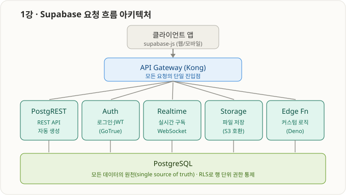
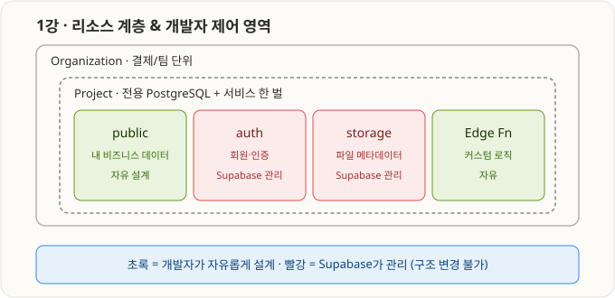

# 1부 · 수파베이스 기초 (1강 ~ 2강)

> Supabase가 무엇이고 어떤 구조로 돌아가는지, 그리고 Organization/Project를 만드는 부분.

---

## 1강 · Supabase 구조 & 생태계



### 한 문장
**PostgreSQL 하나를 중심으로 백엔드 기능(API·인증·실시간·파일저장)을 자동으로 붙여주는 오픈소스 BaaS.**

- **BaaS**(Backend as a Service): 서버를 직접 안 만들어도 백엔드를 빌려 씀 (Firebase가 원조).
- Firebase와 차이: Firebase=NoSQL, **Supabase=관계형 DB(PostgreSQL)** → SQL·외래키·Join·트랜잭션 다 됨. (그래서 SQL DDL을 배운 것)
- **오픈소스** → 내부 공개, self-host 가능, vendor lock-in 없음.

### 어떻게 돌아가나 (요청 흐름)
1. **클라이언트 앱** (`supabase-js`) → 요청
2. **API Gateway (Kong)** — 모든 요청의 단일 진입점, 맞는 서비스로 라우팅
3. **5개 마이크로서비스:**

| 서비스 | 실제 이름 | 역할 |
|---|---|---|
| PostgREST | PostgREST | 테이블 보고 **REST API 자동 생성** (`create table members`→`/members`) |
| Auth | GoTrue | 회원가입·로그인·소셜·**JWT** |
| Realtime | Realtime | DB 변경을 **WebSocket 실시간** 전파 (WAL 감시) |
| Storage | Storage API | **파일 저장** (S3 호환) |
| Edge Functions | Deno | **커스텀 백엔드 로직**(TS) |

4. **PostgreSQL** — 맨 아래 **모든 데이터의 원천**. **RLS**로 행 단위 권한 통제.

> 🔑 핵심 통찰: **DB 스키마가 곧 API.** SQL로 테이블을 잘 설계하면 PostgREST가 API를 자동 생성 → **SQL DDL이 Supabase의 진짜 기초**.

### 리소스 계층 & 제어 영역



```
Organization (결제·팀 단위)
└─ Project (전용 PostgreSQL 1개 + 서비스 한 벌)
   ├─ 🟢 public 스키마    — 내 데이터 (자유 설계)  ← create table members 한 곳
   ├─ 🔴 auth 스키마      — 회원/인증 (Supabase 관리)  ← users.id 가 uuid
   ├─ 🔴 storage 스키마   — 파일 (Supabase 관리)
   └─ 🟢 Edge Functions   — 커스텀 로직 (자유)
```

- 🟢 자유 영역: `public` 스키마, Edge Functions.
- 🔴 관리 영역: `auth`·`storage` 스키마 — 구조 변경 금지(설정은 가능).
- 우리가 배운 것과 연결: `members`는 public, `uuid`는 auth.users.id, RLS·timestamptz 전부 이 구조 위에서 의미.

**출처:** [Architecture Docs](https://supabase.com/docs/guides/getting-started/architecture) · [supabase/supabase](https://github.com/supabase/supabase)
