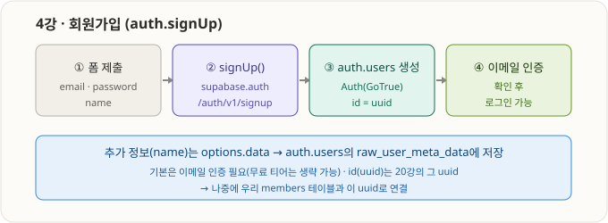
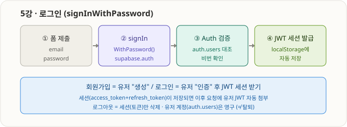

# 2부 · 프론트엔드 회원가입/로그인 연동 (3강 ~ 7강)

> 스타터: 바닐라 JS (CodePen). supabase-js를 esm.sh로 불러와 내 프로젝트에 연결.

---

## 3강 · 프론트 실습 환경 세팅 & 프로젝트 연결

### 핵심
- **연결 = `createClient(URL, anon키)`로 supabase 객체 하나 만드는 것.** 이 객체로 `.auth.signUp()` 등을 호출.
- 스타터는 URL·키를 코드에 하드코딩하지 않고 **localStorage**에서 읽음 → 한 번 저장하면 여러 데모 펜이 공유.
- supabase-js는 **esm.sh**에서 바로 로드(npm 설치 불필요) → CodePen만으로 실습 가능.

### 겪은 문제 & 해결
1. **localStorage 값이 null** — 저장 위치(iframe origin) 혼동. → 펜 JS에 `setItem`을 직접 넣어 확실히 저장.
2. **`Cannot use import statement outside a module`** — 정적 `import`는 모듈 전용. → **동적 `import()` + async IIFE**로 교체하면 어디서든 동작.

### 최종 연결 코드 (바닐라, 동적 import 버전)
```js
console.clear();

localStorage.setItem("SUPABASE_PROJECT_URL", "https://whwhgggqpyqrtetlwqrt.supabase.co");
localStorage.setItem("SUPABASE_PROJECT_PUBLISHABLE_API_KEY", "<내 anon 키>");

(async () => {
  const { createClient } = await import("https://esm.sh/@supabase/supabase-js@2");
  const supabase = createClient(
    localStorage.getItem("SUPABASE_PROJECT_URL"),
    localStorage.getItem("SUPABASE_PROJECT_PUBLISHABLE_API_KEY")
  );
  window.supabase = supabase;
  console.log("연결 완료:", supabase ? "OK" : "실패");
})();
```

- 🔑 anon(publishable) 키만 사용(공개 안전). secret 키·DB 비번은 절대 금지.
- 🖱️ 인증·인가 상세 인터랙티브: [viz/supabase-auth-flow.html](../viz/supabase-auth-flow.html)

### 인증/인가 한 줄 정리 (요청이 어떻게 처리되나)
- 요청 헤더: `apikey`(anon=어느 프로젝트) + `Authorization: Bearer <토큰>`(비로그인=anon / 로그인=유저 JWT).
- **인증** = JWT 서명 검증(위조 불가, GoTrue 발급). **인가** = role→RLS(`auth.uid()`, `auth.jwt()`)로 행 단위 통제.

---

## 4강 · 회원가입 (auth.signUp)



- `auth.signUp({ email, password, options:{ data:{ name } } })` → **auth.users**에 유저 생성(id=uuid).
- `options.data` → `auth.users.raw_user_meta_data`에 JSON으로 저장(예: name).
- 기본은 이메일 인증 필요. 최신 대시보드는 "Confirm email" 토글 위치가 달라 안 보일 수 있음 → **켠 채로 진행해도 회원가입은 됨**(확인은 로그인 가능 여부에만 영향). 확인 장소: Authentication → Users.
- 최종 코드(바닐라, 동적 import + 폼 submit 핸들러):

```js
const { data, error } = await supabase.auth.signUp({
  email, password,
  options: { data: { name } }
});
if (error) { alert("회원가입 실패: " + error.message); return; }
```
```html
<form autocomplete="off">
  <input name="email" type="email" required>
  <input name="password" type="password" required minlength="6">
  <input name="name" type="text" required>
  <button type="submit">회원가입</button>
</form>
```

- 겪은 것: CodePen은 별도 Run 없음(저장=실행), Console 닫으면 프리뷰(폼) 보임, HTML 폼은 HTML 패널에.
- ✅ 회원가입 성공 → Authentication → Users에 uuid로 유저 생성 확인. 이 uuid가 members 연결 열쇠.

## 5강 · 로그인 (signInWithPassword)



- `auth.signInWithPassword({ email, password })` → 성공 시 `data.session`(access_token JWT + refresh_token)을 supabase-js가 **localStorage에 자동 저장** → 로그인 상태.
- 관련: `getUser()`(현재 유저), `signOut()`(세션 삭제), `onAuthStateChange()`(상태 변화 감지).
- Email confirmation 켜져 있어 `Email not confirmed` 나면 SQL Editor에서:
  `update auth.users set email_confirmed_at = now() where email = '...';`

### 🔑 세션(Session) vs 유저 계정(User) — 핵심 구분

| | 유저 계정 (User) | 세션 (Session) |
|---|---|---|
| 사는 곳 | auth.users (백엔드 DB) | 브라우저 localStorage (클라이언트) |
| 내용 | uuid, email, 비번해시 | access_token(JWT, ~1h) + refresh_token |
| 생성 | 회원가입 | 로그인 |
| 삭제 | 탈퇴(Delete user) | 로그아웃 / 만료 |
| 대시보드 | Users에 보임 | 안 보임 |

- **로그아웃 = 세션(토큰)만 삭제 → 유저 계정은 그대로.** 그래서 로그아웃해도 대시보드 Users에 회원이 남아있음(≠ 회원 탈퇴).
- access_token은 짧게(탈취 대비), 만료되면 refresh_token으로 자동 갱신.
- 비유: 유저 계정=헬스장 회원등록(영구) / 세션=오늘 입장 손목밴드(로그인=받기, 로그아웃=반납).

## 6~7강 · 카카오 소셜 로그인 (예정)
