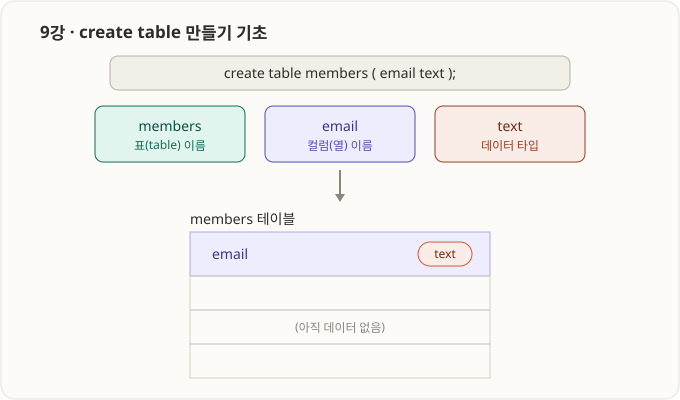
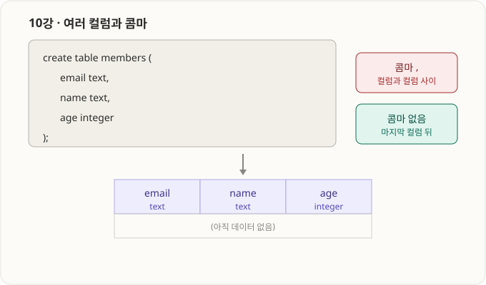
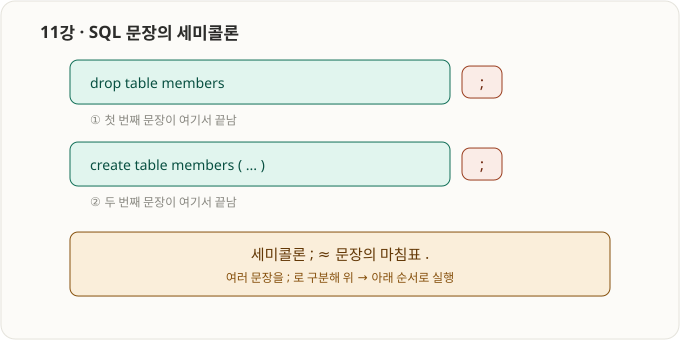
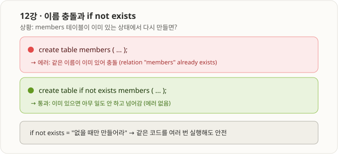
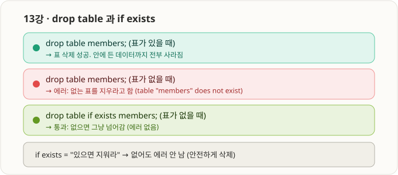
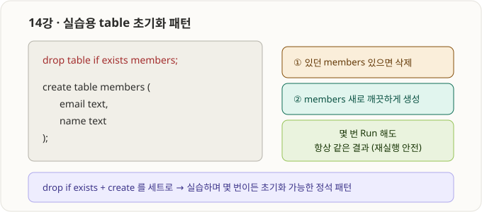

# 4부 · table 생성 기초 (9강 ~ 14강)

> Supabase SQL Editor에서 실습. RLS 경고가 뜨면 `Run and enable RLS` 선택(공개 학습용 안전 습관, SQL Editor는 관리자 권한이라 실습엔 지장 없음).

---

## 9강 · create table 만들기 기초



- `create table`은 **DDL(데이터 정의어)** — 데이터를 넣는 게 아니라 **데이터를 담을 "틀(구조)"** 을 만든다.
- 문장 해부:

| 조각 | 정체 |
|---|---|
| `create table` | "새 테이블 만들어라" 키워드 (대소문자 무관, 이 강의는 소문자 통일) |
| `members` | 테이블 이름 |
| `( ... )` | 컬럼 정의 구역 |
| `email` | 컬럼(열) 이름 |
| `text` | 데이터 타입 |

- 컬럼 정의는 항상 **`이름 타입`** 순서. → `email text`
- `create table`은 **빈 뼈대만** 만든다 (데이터 없음).

```sql
create table members (
    email text
);
```

---

## 10강 · 여러 컬럼과 콤마



- 컬럼 여러 개는 `( )` 안에 나열, **컬럼 사이를 콤마 `,` 로 구분**.
- **마지막 컬럼 뒤에는 콤마를 붙이지 않는다.** (붙이면 문법 에러)
- 줄바꿈/들여쓰기는 문법 필수가 아니라 **가독성용 관례**.

```sql
create table members (
    email text,
    name text,
    age integer   -- 마지막 컬럼, 뒤에 콤마 없음
);
```

- ⚠️ 최다 실수: `age integer,` 처럼 마지막에 콤마 → "콤마 뒤에 뭔가 와야 하는데 `)`가 옴" 에러.
- 관찰: Table Editor에서 `age`가 `int4`로 보임 = `integer`의 내부 정식 이름.

---

## 11강 · SQL 문장의 세미콜론



- **세미콜론 `;` = 한 문장의 끝(마침표).**
- 문장 1개만 실행: 생략해도 대개 동작 (그래도 붙이는 게 습관).
- **여러 문장을 한 번에 실행: `;` 필수** — 없으면 "어디서 문장이 끝나는지" 몰라 에러.
- DB는 `;` 기준으로 잘라 **위 → 아래 순서**로 실행.

```sql
select 'first';   -- 세미콜론으로 구분해야
select 'second';  -- 두 문장을 한 번에 실행 가능
```

---

## 12강 · 이름 충돌과 if not exists



- 같은 이름의 테이블을 다시 만들면 **충돌 에러**: `relation "members" already exists`.
- `if not exists`를 붙이면 **이미 있을 때 조용히 건너뜀(에러 없음)**.

```sql
create table if not exists members (
    email text
);
```

- 의미: **"없을 때만 만들어라"** → 같은 코드를 여러 번 실행해도 안전(idempotent).

---

## 13강 · drop table 과 if exists



- `drop table 이름;` = **표를 통째로 삭제** (안의 데이터까지 전부 사라짐 — 주의!).
- 없는 표를 지우려 하면 에러: `table "members" does not exist`.
- `if exists`를 붙이면 **없어도 에러 안 남(조용히 통과)**.

```sql
drop table if exists members;
```

- 의미: **"있으면 지워라"**.

---

## 14강 · 실습용 table 초기화 패턴



- `drop table if exists` + `create table` 를 **세트로** 사용.
- 몇 번을 실행해도 **항상 깨끗한 상태로 재생성** → 실습에 최적인 정석 패턴.

```sql
drop table if exists members;

create table members (
    email text,
    name text
);
```

- 실습 도중 구조를 바꾸고 싶을 때 이 두 줄을 앞에 두고 자유롭게 재실행하면 된다.

---

### 4부 한 줄 요약
> 테이블은 `create table 이름 (컬럼 타입, ...)` 으로 만들고, 컬럼은 콤마로 구분(마지막 뒤 X), 문장은 `;`로 끝낸다. 재실행 안전을 위해 `if not exists` / `if exists`, 실습 초기화는 `drop if exists + create` 세트.
