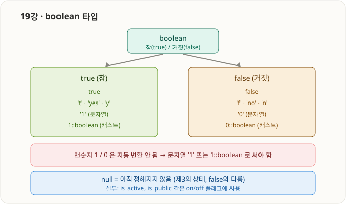
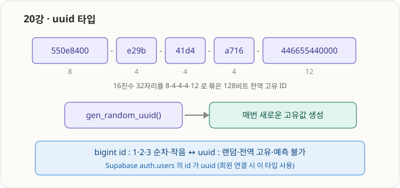

# 5부 · PostgreSQL 기본 타입 (15강 ~ 20강) ✅ 완료

> 15~17강은 기본 SQL 지식으로 대부분 아는 구간이라 핵심 + PostgreSQL 차이점 위주. 18강부터는 정속 학습.

---

## 15강 · 타입이란?


- **타입 = 그 컬럼(칸)에 담을 수 있는 값의 "종류"를 정하는 규칙.**
- 타입에 어긋난 종류의 값을 넣으면 DB가 **거부(에러)** 한다 → 데이터 품질을 지켜줌.

| 컬럼 | 타입 | 받는 값 | 거부 |
|---|---|---|---|
| email | `text` | `'abc@x.com'` | (문자는 대부분 허용) |
| age | `integer` | `25` | `'스물다섯'`(문자) → 에러 |
| is_active | `boolean` | `true` / `false` | `'maybe'` → 에러 |

---

## 16강 · 문자열 타입 (text, varchar, varchar(N))


| 타입 | 설명 |
|---|---|
| `text` | 길이 제한 없는 문자열 |
| `varchar` | 길이 제한 없음 — PostgreSQL에선 `text`와 **사실상 동일** |
| `varchar(N)` | **최대 N자**까지만 허용 (초과 시 에러 `value too long`) |

- 핵심 차이: **PostgreSQL에서 `text` vs `varchar` 는 성능 차이가 거의 없다.** (다른 DB 상식과 다른 부분)
- → 길이 제한이 **꼭 필요할 때만** `varchar(N)`, 아니면 그냥 `text`.

```sql
create table demo (
    bio text,            -- 제한 없는 긴 글
    nickname varchar(20) -- 최대 20자
);
```

---

## 17강 · 정수 타입 (integer, bigint)


| 타입 | 별칭 | 범위 | 크기 |
|---|---|---|---|
| `integer` | `int4` | 약 ± 21억 (-2,147,483,648 ~ 2,147,483,647) | 4바이트 |
| `bigint` | `int8` | 약 ± 922경 | 8바이트 |

- **헷갈리면 `bigint`가 안전** (범위 초과 위험 없음).
- **id 컬럼엔 보통 `bigint`** 를 쓴다 → 28강(identity + primary key)에서 이 패턴을 배움.

```sql
create table demo (
    small_count integer,
    big_id bigint
);
```

---

---

## 18강 · 날짜/시간 타입 (timestamp, timestamptz)


- 이름이 곧 정체:
  - `timestamp` = `timestamp **without** time zone` → 시각 문자만 저장 (**시간대 없음**)
  - `timestamptz` = `timestamp **with** time zone` → 절대 순간 저장 (내부 UTC), 조회 시 세션 시간대로 변환

| 구분 | `timestamp` | `timestamptz` ✅ |
|---|---|---|
| 저장하는 것 | 날짜+시간 문자 그대로 | 절대 순간(내부 UTC) |
| 시간대 정보 | 없음 | 있음 |
| 조회 시 | 저장된 문자 그대로 | 보는 사람 시간대로 자동 변환 |

- **함정:** `timestamp`는 시간대 꼬리표가 없어, 서버·지역이 다르면 같은 값이 다른 순간으로 해석됨 → **조용히 틀리는 데이터 버그**(문법 에러가 아니라 더 위험).
- **결론:** 날짜/시간은 웬만하면 무조건 **`timestamptz`**. Supabase 자동 컬럼(`created_at` 등)도 전부 timestamptz, `now()`도 timestamptz 반환.

```sql
create table demo_time (
    ts   timestamp,    -- 시간대 없음
    tstz timestamptz   -- 시간대 있음
);
insert into demo_time (ts, tstz) values (now(), now());
select * from demo_time;
-- 관찰: tstz 값 끝에만 +00(UTC 오프셋)이 붙는다.
```

---

---

## 19강 · boolean 타입



- `boolean`(= `bool`)은 **`true`(참) / `false`(거짓)** 두 값. 저장/표시는 항상 true/false(짧게 `t`/`f`).
- 입력은 관대하지만 **문자열일 때** 얘기:
  - 참: `true`, `'t'`, `'true'`, `'yes'`, `'y'`, `'on'`, `'1'`
  - 거짓: `false`, `'f'`, `'false'`, `'no'`, `'n'`, `'off'`, `'0'`
- ⚠️ **함정(직접 겪은 에러):** 맨숫자 정수 `1`/`0`은 boolean으로 **자동 변환 안 됨** → `ERROR 42804: ... is of type boolean but expression is of type integer`.
  - 해결: 문자열 `'1'` 또는 명시적 캐스트 `1::boolean`.
  - 배운 개념: **암시적 캐스트(자동) vs 명시적 캐스트(`::타입` 직접 지시)**.

### 3-state — null ≠ false
| 상태 | 의미 |
|---|---|
| `true` | 참 |
| `false` | 거짓 |
| `null` | 아직 정해지지 않음/모름 (**false와 다름**) |

- 실무 쓰임: `is_active`, `is_public`, `is_deleted`, `email_verified` 같은 on/off 플래그.

```sql
insert into demo_bool (label, is_active) values
    ('문자1로 입력', '1'),        -- OK (문자열)
    ('숫자1 캐스트', 1::boolean), -- OK (명시적 캐스트)
    ('미정(null)',   null);       -- null 그대로
-- ('맨숫자', 1)  → ERROR 42804 (정수는 자동 변환 안 됨)
```

---

---

## 20강 · uuid 타입



- `uuid` = 16진수 32자리를 `8-4-4-4-12`로 묶은 **128비트 전역 고유 ID**.
  예) `550e8400-e29b-41d4-a716-446655440000`
- 특징: **조율 없이 생성해도 사실상 안 겹침** · **예측 불가(랜덤)**.
- 생성 함수: **`gen_random_uuid()`** (안 되면 `extensions.gen_random_uuid()`).

| | `bigint` (자동증가) | `uuid` |
|---|---|---|
| 값 | 1·2·3 순차 | 랜덤 128비트 |
| 크기/속도 | 작음(8B)·빠름 | 큼(16B) |
| 예측 | 가능 | 불가 |
| 생성 조율 | 필요 | 불필요 |
| 대표 사용처 | 내부 PK (27~29강) | 분산 환경, Supabase `auth.users.id` |

- 💡 **Supabase `auth.users.id` 가 uuid** → members를 로그인 사용자와 연결할 때 이 타입으로 잇는다. (8강 최종 SQL의 `auth_user_id uuid`)

```sql
create table demo_uuid (
    id    uuid default gen_random_uuid(),  -- 안 넣으면 자동 채움
    label text
);
insert into demo_uuid (label) values ('첫 행'), ('둘째 행');
-- id를 직접 안 넣어도 행마다 다른 uuid가 자동으로 채워짐
```

---

### 5부(15~20) 한 줄 요약
> 타입은 컬럼이 받을 값의 종류를 강제한다. 문자열 `text`, 정수 `bigint`, 날짜/시간 `timestamptz`, 참/거짓 `boolean`, 고유 식별자 `uuid`. 다음 6부는 **제약조건**(not null, unique, primary key, default) — "어떤 값을 허용/금지할지" 규칙을 건다.
