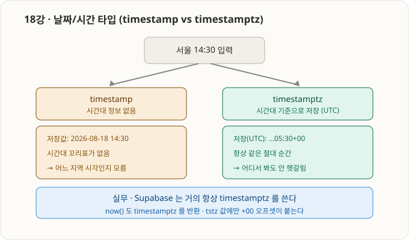

# 5부 · PostgreSQL 기본 타입 (15강 ~ 20강)

> 15~17강은 기본 SQL 지식으로 대부분 아는 구간이라 핵심 + PostgreSQL 차이점 위주. 18강부터는 정속 학습.

---

## 15강 · 타입이란?


- **타입 = 그 컬럼(칸)에 담을 수 있는 값의 "종류"를 정하는 규칙.**
- 타입에 어긋난 종류의 값을 넣으면 DB가 **거부(에러)** 한다 → 데이터 품질을 지켜줌.

| 컬럼 | 타입 | 받는 값 | 거부 |
|---|---|---|---|
| email | `text` | `'abc@x.com'` | (문자는 대부분 허용) |
| age | `integer` | `25` | `'스물다섯'`(문자) → 에러 |
| is_active | `boolean` | `true` / `false` | `'maybe'` → 에러 |

---

## 16강 · 문자열 타입 (text, varchar, varchar(N))


| 타입 | 설명 |
|---|---|
| `text` | 길이 제한 없는 문자열 |
| `varchar` | 길이 제한 없음 — PostgreSQL에선 `text`와 **사실상 동일** |
| `varchar(N)` | **최대 N자**까지만 허용 (초과 시 에러 `value too long`) |

- 핵심 차이: **PostgreSQL에서 `text` vs `varchar` 는 성능 차이가 거의 없다.** (다른 DB 상식과 다른 부분)
- → 길이 제한이 **꼭 필요할 때만** `varchar(N)`, 아니면 그냥 `text`.

```sql
create table demo (
    bio text,            -- 제한 없는 긴 글
    nickname varchar(20) -- 최대 20자
);
```

---

## 17강 · 정수 타입 (integer, bigint)


| 타입 | 별칭 | 범위 | 크기 |
|---|---|---|---|
| `integer` | `int4` | 약 ± 21억 (-2,147,483,648 ~ 2,147,483,647) | 4바이트 |
| `bigint` | `int8` | 약 ± 922경 | 8바이트 |

- **헷갈리면 `bigint`가 안전** (범위 초과 위험 없음).
- **id 컬럼엔 보통 `bigint`** 를 쓴다 → 28강(identity + primary key)에서 이 패턴을 배움.

```sql
create table demo (
    small_count integer,
    big_id bigint
);
```

---

---

## 18강 · 날짜/시간 타입 (timestamp, timestamptz)



- 이름이 곧 정체:
  - `timestamp` = `timestamp **without** time zone` → 시각 문자만 저장 (**시간대 없음**)
  - `timestamptz` = `timestamp **with** time zone` → 절대 순간 저장 (내부 UTC), 조회 시 세션 시간대로 변환

| 구분 | `timestamp` | `timestamptz` ✅ |
|---|---|---|
| 저장하는 것 | 날짜+시간 문자 그대로 | 절대 순간(내부 UTC) |
| 시간대 정보 | 없음 | 있음 |
| 조회 시 | 저장된 문자 그대로 | 보는 사람 시간대로 자동 변환 |

- **함정:** `timestamp`는 시간대 꼬리표가 없어, 서버·지역이 다르면 같은 값이 다른 순간으로 해석됨 → **조용히 틀리는 데이터 버그**(문법 에러가 아니라 더 위험).
- **결론:** 날짜/시간은 웬만하면 무조건 **`timestamptz`**. Supabase 자동 컬럼(`created_at` 등)도 전부 timestamptz, `now()`도 timestamptz 반환.

```sql
create table demo_time (
    ts   timestamp,    -- 시간대 없음
    tstz timestamptz   -- 시간대 있음
);
insert into demo_time (ts, tstz) values (now(), now());
select * from demo_time;
-- 관찰: tstz 값 끝에만 +00(UTC 오프셋)이 붙는다.
```

---

### 5부(15~18) 한 줄 요약
> 타입은 컬럼이 받을 값의 종류를 강제한다. 문자열은 기본 `text`, 정수는 넉넉하게 `bigint`, 날짜/시간은 무조건 `timestamptz`(시간대 안전). 다음은 `boolean`(19강), `uuid`(20강).
