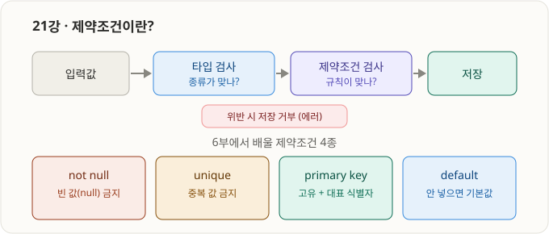
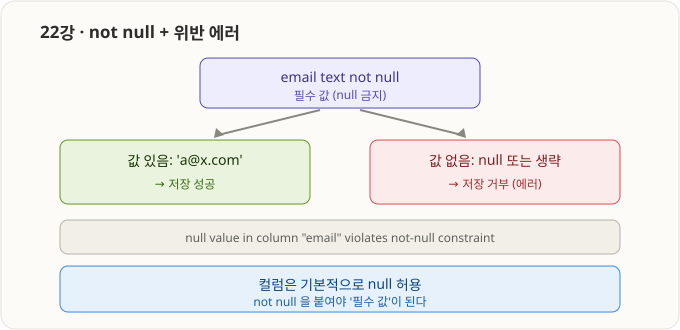
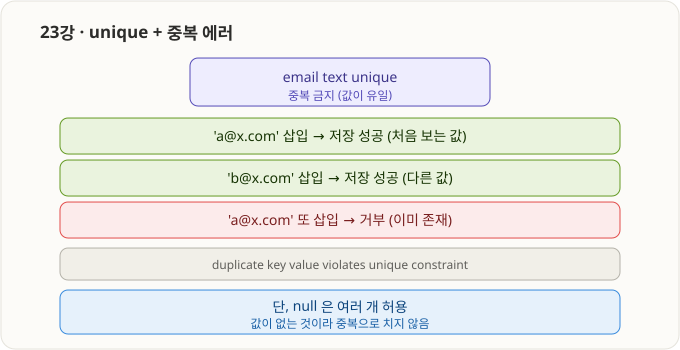
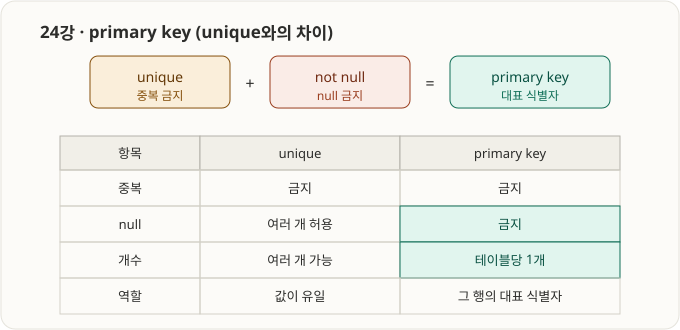
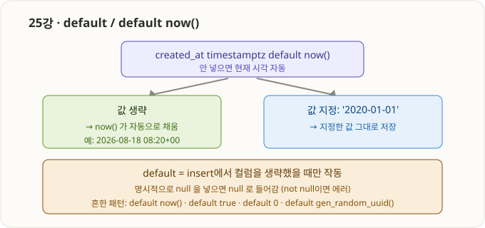
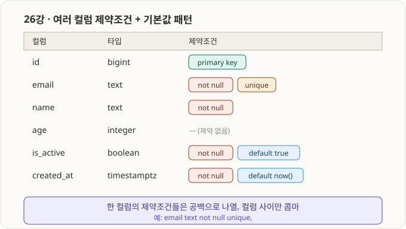

# 6부 · 제약조건 기초 (21강 ~ 26강) ✅ 완료

> 제약조건 = 데이터가 저장되기 전 통과해야 하는 "규칙". 타입이 값의 종류를 막는다면, 제약조건은 값의 조건을 막는다.

---

## 21강 · 제약조건이란?



- **제약조건(constraint)** = 컬럼/테이블에 거는 규칙. 데이터 무결성(integrity)을 지킨다.
- 규칙을 어긴 값은 **DB가 거부(에러)** → 앱 버그와 무관하게 데이터 품질을 지키는 마지막 방어선.

| | 무엇을 검사 | 예 |
|---|---|---|
| 타입 | 값의 **종류** | `age integer` → 문자 거부 |
| 제약조건 | 값의 **규칙** | `email not null` → 빈 값 거부 |

- 6부에서 배울 4종: `not null`(22), `unique`(23), `primary key`(24), `default`(25), 그리고 조합 패턴(26).
- 이미 맛본 것: 20강의 `default gen_random_uuid()` 의 `default`가 제약조건.

```sql
create table demo_rule (
    email text not null   -- 빈 값 금지 규칙
);
insert into demo_rule (email) values ('a@x.com');  -- OK
insert into demo_rule (email) values (null);       -- 거부(에러)
```

---

## 22강 · not null + 위반 에러



- `not null` = 그 컬럼에 **null 금지**, 반드시 값 필요.
- **기본은 nullable** — 아무것도 안 붙이면 null 허용. `not null`을 명시해야 필수가 됨.
- 위반 두 경우: ① null 직접 넣기 ② insert에서 컬럼 생략(자동 null).
- 위반 에러: `null value in column "email" violates not-null constraint`.
- 실무: `email`·`name`·`created_at` 등 필수 정보에 건다. `memo`·`phone` 등 선택 정보엔 안 건다.

```sql
create table demo_notnull (
    email text not null,   -- 필수
    memo  text             -- 선택(null 허용)
);
insert into demo_notnull (email) values ('b@x.com');  -- memo 생략 OK
-- insert into demo_notnull (memo) values ('x');       -- email 생략 → 에러
```

---

## 23강 · unique + 중복 에러



- `unique` = 그 컬럼 값이 **전체 행에서 유일**해야 함(중복 금지).
- 위반 에러: `duplicate key value violates unique constraint "..."`.
- ⚠️ **null은 예외** — unique 컬럼에도 `null`은 **여러 개 허용**(값 없음이라 서로 같다고 안 봄). ← 직접 확인함.
- "중복 없이 + 반드시 존재"까지 원하면 **`unique` + `not null`** → 이게 24강 `primary key`의 정체.
- 실무: `email`, `username`, 사업자번호 등 중복되면 안 되는 값.

```sql
create table demo_unique ( email text unique );
insert into demo_unique (email) values ('a@x.com');  -- OK
-- insert into demo_unique (email) values ('a@x.com'); -- 거부(중복)
insert into demo_unique (email) values (null);
insert into demo_unique (email) values (null);       -- null 두 개 OK(예외)
```

---

## 24강 · primary key (unique와의 차이)



- **`primary key` = `unique` + `not null` + 테이블당 1개 + 그 행의 대표 식별자.**
- 중복 금지 + null 금지가 자동 적용 → 한 컬럼이 두 종류 에러를 다 낼 수 있음(중복=unique 위반, null=not-null 위반).

| 항목 | `unique` | `primary key` |
|---|---|---|
| 중복 | 금지 | 금지 |
| null | 여러 개 허용 | **금지** |
| 개수 | 여러 개 가능 | **테이블당 1개** |
| 역할 | 값이 유일 | 그 행의 **대표 식별자** |

- 실무: 거의 모든 테이블에 `id` 컬럼을 primary key로. (이 id를 자동 증가시키는 게 7부 identity)

```sql
create table demo_pk (
    id    bigint primary key,
    email text
);
insert into demo_pk (id, email) values (1, 'a@x.com');  -- OK
-- (1, ...)     → 중복 거부
-- (null, ...)  → null 거부
```

---

## 25강 · default / default now()



- `default 값` = insert에서 컬럼을 **생략하면 자동으로 채워지는 기본값**.
- `default now()` = 생략 시 **현재 시각** → `created_at` 국룰 패턴.
- ⚠️ **작동 조건:** 컬럼을 "생략"했을 때만. **명시적 `null`을 넣으면 null**이 들어감(default 무시, not null이면 에러).
- 흔한 default: `now()`, `true`/`false`, `0`, `gen_random_uuid()`(20강에서 이미 씀).

```sql
create table demo_default (
    id         bigint,
    is_active  boolean     default true,
    created_at timestamptz default now()
);
insert into demo_default (id) values (1);  -- is_active=true, created_at=현재시각 자동
```

---

## 26강 · 여러 컬럼 제약조건 + 기본값 패턴 (종합)



- **한 컬럼에 제약조건 여러 개** = 타입 뒤에 **공백으로 나열**: `email text not null unique`.
- **컬럼과 컬럼 사이만 콤마** — 콤마 빠지면 `42601 syntax error`(10강 규칙!). 제약조건 사이엔 콤마 안 씀.
- `not null default ...` 조합이 실무 국룰: "필수지만 안 넣으면 기본값 자동" → insert는 간결, 데이터는 안전.

```sql
create table demo_full (
    id         bigint      primary key,
    email      text        not null unique,
    name       text        not null,
    age        integer,
    is_active  boolean     not null default true,
    created_at timestamptz not null default now()
);
insert into demo_full (id, email, name) values (1, 'a@x.com', '홍길동');
-- age=null, is_active=true, created_at=현재시각 자동
```

- 이게 8강 최종 SQL의 `members`/`posts` 테이블이 생긴 원리. 컬럼마다 제약조건을 조합한 것일 뿐.

---

### 6부(21~26) 한 줄 요약
> 제약조건은 값의 규칙을 강제한다. `not null`(빈값 금지), `unique`(중복 금지, null은 예외), `primary key`(=unique+not null, 테이블당 1개 대표 식별자), `default`(생략 시 기본값). 한 컬럼에 여러 개는 공백으로 나열, 컬럼 사이는 콤마. 다음 7부는 id를 자동 증가시키는 `identity`.
