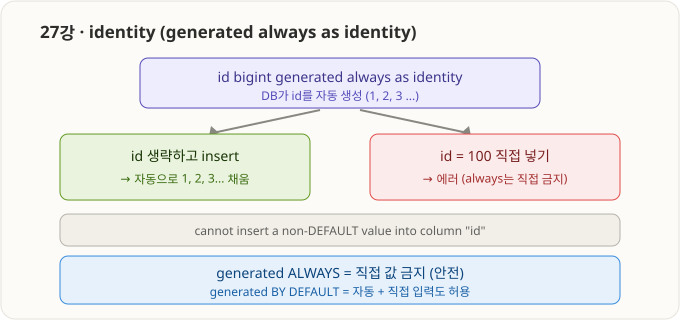
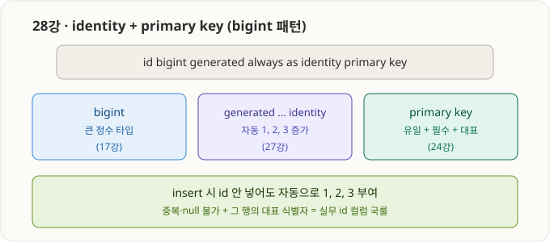
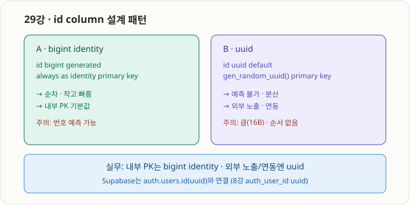

# 7부 · identity와 자동 증가 (27강 ~ 29강) ✅ 완료

> 지금까지 id를 손으로 1, 2 넣던 걸 DB가 자동으로 매기게 하는 기능. 24강 primary key와 합쳐 실무 id 컬럼을 완성한다.

---

## 27강 · identity 개념 (generated always as identity)



- `generated always as identity` = 그 컬럼(보통 `id`)을 **DB가 자동으로 순차 생성**(1, 2, 3...).
- MySQL `AUTO_INCREMENT`와 같은 역할이지만 **SQL 표준** 방식.
- **두 모드:**

| 모드 | 자동 생성 | 직접 입력 |
|---|---|---|
| `generated always as identity` | O | **X (에러)** — 엄격/안전, 국룰 |
| `generated by default as identity` | O | O |

- `always` 컬럼에 직접 값 넣으면: `cannot insert a non-DEFAULT value into column "id"`.
- 왜 always가 국룰? id는 DB가 관리하는 내부 식별자 → 앱이 직접 정하면 충돌·혼란. always로 원천 차단.

```sql
create table demo_identity (
    id   bigint generated always as identity,
    name text
);
insert into demo_identity (name) values ('a'), ('b'), ('c');  -- id 1,2,3 자동
-- insert into demo_identity (id, name) values (100, 'x');     -- 에러(직접 금지)
```

---

## 28강 · identity + primary key (bigint 패턴)



- 실무 표준 id 컬럼 = **세 조각의 합체**:

```sql
id bigint generated always as identity primary key
```

| 조각 | 역할 | 강 |
|---|---|---|
| `bigint` | 큰 정수 타입 (id가 많아져도 넉넉) | 17강 |
| `generated always as identity` | 자동 1,2,3 증가 (직접 입력 금지) | 27강 |
| `primary key` | 유일 + 필수 + 대표 식별자 | 24강 |

- 결과: insert 시 id 신경 안 써도 자동 부여 + 중복/null 불가.
- `integer`가 아니라 `bigint`인 이유: id는 계속 증가하니 넉넉하게. (17강 예고)
- 8강 최종 SQL의 id 컬럼이 정확히 이 형태.

```sql
create table demo_member (
    id    bigint generated always as identity primary key,
    email text not null unique,
    name  text not null
);
insert into demo_member (email, name) values ('a@x.com', '홍길동');  -- id 1 자동
```

---

## 29강 · id column 설계 패턴



두 패턴 중 목적에 맞게 선택:

| | A · `bigint` identity | B · `uuid` |
|---|---|---|
| 선언 | `id bigint generated always as identity primary key` | `id uuid default gen_random_uuid() primary key` |
| 값 | 순차 1,2,3 | 랜덤 |
| 장점 | 작고 빠름, 내부 PK 기본 | 예측 불가, 분산·외부 노출 |
| 단점 | 번호 예측 가능 | 큼(16B), 순서 없음 |

**실무 가이드**
- 내부 PK → `bigint` identity
- 외부 URL/API 노출 → `uuid`
- 로그인 사용자 연동 → `uuid` (Supabase `auth.users.id`)
- 둘 다 필요 → bigint 내부 PK + uuid 공개 컬럼 병행

- 8강 최종 SQL: `members.id`/`posts.id` = bigint identity, `auth_user_id` = uuid.

---

### 7부(27~29) 한 줄 요약
> `generated always as identity`로 id를 자동 증가시키고(직접 입력 금지), `bigint ... identity primary key`가 실무 내부 PK 국룰. 외부 노출/연동엔 `uuid`. id 설계는 "내부는 bigint, 외부는 uuid"가 핵심.
